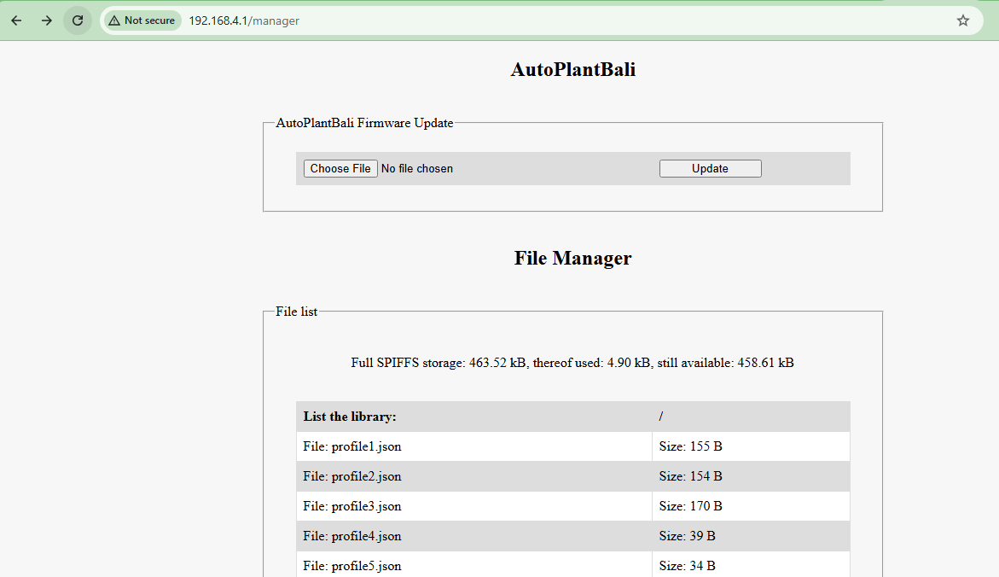

# AutoPlantBali RC
AutoPlantBali RC adalah remote control berbasis esp32 yang dikembangkan dari code sumber:
[RomanLut](https://github.com/RomanLut/hx_espnow_rc). Untuk Transmitter dan Receiver memiliki beberapa mode yang bisa digunakan.

## Transmitter AutoPlantBali RC
Transmitter AutoPlantBali adalah external module remote yang dapat menerima signal SBUS, PPM, stick PS2 dan remote control mobile apps (RemoteXY) via bluetooth.

Marketplace: [TOCO](https://toco.id/store/auto-plant-bali), Forum Diskusi: [Auto Plant Bali Community](https://toco.id/community/auto-plant-bali-rc)

* ### Fitur:
    - Support 16 Channel
    - Normal & Long Range Mode
    - Multiple Profile
    - Telemetry SPORT
    - Select Active Profile By CH16 
* ### Transmitter Wiring Diagram
  
  
  
* ### Configuration File

| KEY                           | VALUE                             | KETERANGAN         |
|:------------------------------|:---------------------------------:|:-------------------|
| PPM_MAX_CHANNEL               | max 12, Default: 8                | Sesuikan dengan PPM out pada remote (channel terakhir akan menjadi channel 16 untuk config)|
| AILERON_REVERSE               | 1 or 0, Default: 0                | Set 1 untuk membalikan nilai dari aileron (hanya untuk mode PS2 dan RemoteXY)|
| ELEVATOR_REVERSE              | 1 or 0, Default: 0                | Set 1 untuk membalikan nilai dari elevator (hanya untuk mode PS2 dan RemoteXY)|
| RUDDER_REVERSE                | 1 or 0, Default: 0                | Set 1 untuk membalikan nilai dari rudder (hanya untuk mode PS2 dan RemoteXY)|
| REMOTEXY_PROFILE              | 1 ~ 10, Default: 1                | Pilih profile untuk app REMOTEXY (Android / Ios)|
| REMOTEXY_MODEL                | 1 or 2, Default: 1                | Pilih model/desain dari app REMOTEXY (Android / Ios)|
| REMOTEXY_THROTTLE_CENTER      | 1 or 0, Default: 0                | Pilih throttle center = 0 untuk rc plane atau 1 untuk rc car|
| REMOTEXY_ACCESS_PASSWORD      | 4 digit number, Default: 1234     | Password akses untuk membuka menu remote di app REMOTEXY (Android / Ios)|
| REMOTEXY_SERIAL_SPEED         | 9600 or 19200, Default: 9600      | Hubungkan module bluetooth HC-05 atau HM-10 untuk terhubung ke app REMOTEXY (Android / Ios)|
| ALARM_VBAT                    | 1 or 0, Default: 0                | Set 1 untuk mengaktifkan alarm low battery dan 0 untuk menonaktifkannya|
| MIN_ALARM_VBAT                | Volt Battery x 10, Default: 35    | Set volt per cell battery dikali 10, contoh: set 3.5Volt untuk aktifakan alarm maka valuenya 35|
| VBAT_OFFSET                   | Vbat offset value                 | Atur nilai offset vbat, contoh: battery 4V tapi di tampilan 3.5V, maka perlu atur nilai 0.5 agar sesuai dengan volt battery yaitu nilai offset 0.5 dikali 10 = 5|
| FLIP_DISPLAY                  | 1 or 0, Default: 0                | Set 1 untuk membalikan tampilan layar LCD 180 derajat|

* ### Update Firmware TX
1. Pilih profile 10 (Configuration mode), setelah itu hubungkan laptop / hp dengan nama wifi sesuai dengan **ap_name** (defaul: hxrct) lalu ketik di browser dengan url: 192.168.4.1/manager dan login dengan user: **admin** dan password: **admin**

2. Klik Choose File dan browse file bin di folder [TX](https://github.com/AutoPlantBali/AutoPlantBali_RC/tree/main/TX)
3. Klik Update untuk melakukan update firmware TX dan tunggu beberapa saat sampai proses update firmware selesai.
   
* ### Setup:
    * ### Radio

      

      
      
      
      
      

      ### SBUS
      1. Create model selanjutnya pada tab External RF pilih SBUS.
          
      2. Pada tab mixes pilih CH16 lalu klik edit.
         
         
      3. Setting weight **0** dan offset sesuai profile yang ingin dipilih.

         - 1000...1100 ( or -100%) - profile 1
         - 1100...1200 ( or -80%)  - profile 2
         - 1200...1300 ( or -60%)  - profile 3
         - 1300...1400 ( or -40%)  - profile 4
         - 1400...1500 ( or -20%)  - profile 5
         - 1500...1600 ( or 0%)    - profile 6
         - 1600...1700 ( or +20%)  - profile 7
         - 1700...1800 ( or +40%)  - profile 8
         - 1800...1900 ( or +60%)  - profile 9
         - 1900...2000 ( or +80%)  - profile 10 (Configuration mode)

         
             

      ### PPM
      1. Create model selanjutnya pada tab External RF pilih PPM. Default max ch range 8.
          
      2. Pada tab mixes pilih channel sesuai dengan max ch range lalu klik edit.
         
         
      3. Setting weight **0** dan offset sesuai profile yang ingin dipilih.

         - 1000...1100 ( or -100%) - profile 1
         - 1100...1200 ( or -80%)  - profile 2
         - 1200...1300 ( or -60%)  - profile 3
         - 1300...1400 ( or -40%)  - profile 4
         - 1400...1500 ( or -20%)  - profile 5
         - 1500...1600 ( or 0%)    - profile 6
         - 1600...1700 ( or +20%)  - profile 7
         - 1700...1800 ( or +40%)  - profile 8
         - 1800...1900 ( or +60%)  - profile 9
         - 1900...2000 ( or +80%)  - profile 10 (Configuration mode)

         
            
  
    * ### PS2 Controller
      * ### PS2 Wiring

        | TX PIN          | PS2 PIN           |
        |:----------------|:------------------|
        | 3V3             | VCC               |
        | VSS             | GND               |
        | PS2_ATT         | CS (Attention)    |
        | PS2_CLK         | CLK (Clock)       |
        | PS2_CMD         | DO (Command)      |
        | PS2_DAT         | DI (Data)         |
      
        
        

      * ### Select Profile
        Untuk mengganti profile TX dengan cara tekan tombol **SELECT** pada PS2 Controller
      * ### Calibate Joystick
        Untuk melakukan kalibrasi joystick dengan cara masuk mode profile 10 (Config) lalu tekan tombol **START**, tunggu beberapa saat sampai proses kalibrasi selesai. Pada saat kalibrasi analog joystick tidak boleh digerakan atau dalam posisi center.

        
        
      
    * ### RemoteXY (Android and Ios)
      HC-05 Bluetooth Module  
      

      HM-10 Bluetooth Module
      

      | TX PIN          | HC-05 / HM-10 |
      |:----------------|:--------------|
      | 3V3             | VCC           |
      | VSS             | GND           |
      | PS2_CMD         | TX            |
      | PS2_DAT         | RX            |

      Setting baudrate module HC-05 / HM-10 harus sama dengan yang ada di file config [**REMOTEXY_SERIAL_SPEED**](https://github.com/AutoPlantBali/AutoPlantBali_RC?tab=readme-ov-file#configuration-file)

      **Model 1**
      
      

      **Model 2**
      
      

    * ### LCD Display TX
      LCD OLED 0.91 Inch 128x32 I2C
      

      | TX PIN          | LCD OLED 0.91 Inch |
      |:----------------|:-------------------|
      | 3V3             | VCC                |
      | VSS             | GND                |
      | SCL             | SCL                |
      | SDA             | SDA                |    

* ### Profiles:
    - **Profile 1**
    ```json
    {
        "transmitter_mode" : "ESPNOW",
        "espnow_channel" : 3,
        "espnow_key" : 0,
        "espnow_long_range_mode" : false,
        "ap_name" : "hxrct",
        "ap_password" : ""
    }
    ```
    - **Profile 2**
    ```json
    {
        "transmitter_mode" : "ESPNOW",
        "espnow_channel" : 3,
        "espnow_key" : 0,
        "espnow_long_range_mode" : true,
        "ap_name" : "hxrct",
        "ap_password" : ""
    }
    ```
    - **Profile 3**
    ```json
    {
        "transmitter_mode": "XIROMINI",
        "ap_name": "XIRO_RC",
        "ap_password": "XIRO1234",
        "ap_channel": 3,
        "drone": "XPLORER_Mini_0b4a41",
        "drone_password": "XIRO1234"
    }
    ```
    - **Profile 4**
    ```json
    {
        "transmitter_mode": "BLEGAMEPAD"
    }
    ```
    - **Profile 5**
    ```json
    {
        "transmitter_mode": "KYFPV"
    }
    ```
    - **Profile 6**
    ```json
    {
        "transmitter_mode" : "ESPNOW",
        "espnow_channel" : 3,
        "espnow_key" : 0,
        "espnow_long_range_mode" : false,
        "ap_name" : "hxrct",
        "ap_password" : "",
        "packet_rate" : "MAX",
        "phy_rate" : "1M"
    }
    ```
    - **Profile 10 (Configuration Mode)**
    ```json
    {
        "transmitter_mode" : "CONFIG",
        "ap_name" : "hxrct",
        "ap_password" : ""
    }
    ```

## Receiver AutoPlantBali RC
Marketplace: [TOCO](https://toco.id/store/auto-plant-bali), Forum Diskusi: [Auto Plant Bali Community](https://toco.id/community/auto-plant-bali-rc)

* ### Receiver Wiring Diagram

  

  [Firmware File](https://github.com/AutoPlantBali/AutoPlantBali_RC/tree/main/RX/APB)
  
* ### Configuration File

| KEY                 | VALUE                     | KETERANGAN         |
|:--------------------|:--------------------------|:-------------------|
| APB_ID              |                           | ID Device|
| VERSION             |                           | Versi dari firmware rx|
| DEVELOP             |                           | Pembuat firmware|
| WIFI_CHANNEL        | 1 ~ 11, Default: 3        | Range channel wifi dan kombinasi dengan key sebagai kode unik ke TX|
| KEY                 | 0 ~ 65535, Default: 0     | Key yang dikombinasi dengan channel wifi sebagai kode unik ke TX|
| WIFI_PASSWORD       | Password wifi rx          | Password wifi RX|
| LR_MODE             | 1 or 0, Defualt: 0        | Set 1 untuk mode Long Range dan 0 untuk mode normal|
| LOG_ACTIVE          | 1 or 0, Default: 0        | Set 1 untuk mengaktifkan openlog dan 0 untuk menonaktifkannya|
| SBUS_ACTIVE         | 1 or 0, Default: 0        | Set 1 untuk masuk ke mode RX SBUS output dan 0 untuk masuk ke RC mode|
| RC_MODE             | 1 ~ 10, Default: 1         | Setting [RC Mode](https://github.com/AutoPlantBali/AutoPlantBali_RC/tree/main#mode-receiver-rc), lepas semua yang terhubung ke pin RX sebelum melakukan perubahan|
| LOG_BAUDRATE        | max 4000000               | Setting speed baudrate dari openlog|
| ESC_CALIBRATION     | 1 or 0, Default: 0        | ESC calibraton saat pertama kali dihidupkan (khusus untuk ESC simonk)|
| ADJUST_AILERON      | -400 ~ 500, Default: 0    | Adjust range servo aileron (untuk beberapa jenis servo 0 ~ 180 derajat memiliki range 500uS ~ 2500uS)|
| ADJUST_ELEVATOR     | -400 ~ 500, Default: 0    | Adjust range servo elevator (untuk beberapa jenis servo 0 ~ 180 derajat memiliki range 500uS ~ 2500uS)|
| ADJUST_RUDDER       | -400 ~ 500, Default: 0    | Adjust range servo rudder (untuk beberapa jenis servo 0 ~ 180 derajat memiliki range 500uS ~ 2500uS)|
| REMOTEXY_ACTIVE     | 1 or 0, Default: 0        | Set 1 untuk mengaktifkan rx standalone menggunakan aplikasi RemoteXY di Android atau Ios |
| REMOTEXY_WIFI_SSID  | Wifi SSID name            | Nama dari access point / hotspot |
| REMOTEXY_WIFI_PASSWORD | Wifi Password          | Password dari access point / hotspot |
| REMOTEXY_SERVER_PORT | Default: 6377            | Port server untuk terhubung ke aplikasi RemoteXY |
| REMOTEXY_ACCESS_PASSWORD | Default: 1234        | Password access untuk mengakses GUI dari remote |
| REMOTEXY_THROTTLE_CENTER | 1 or 0, Default: 1   | Set 1 untuk posisi throttle di tengah seperti mode rc car / boat dan set 0 untuk  posisi throttle di bawah untuk mode rc plane |   
| UPDATE_FIRMWARE     | 1 or 0, Default: 0        | Set 1 untuk melakukan update firmware, pastikan file firmware.bin ada di microSD card|

* ### Update Firmware RX
1. copy file firmware.bin yang ada pada folder [RX](https://github.com/AutoPlantBali/AutoPlantBali_RC/tree/main/RX) ke micro SD (file firmware.bin tidak boleh di dalam folder di micro SD)
2. pada file config.txt ubah **UPDATE_FIRMWARE** menjadi **1** untuk melakukan update firmware.
3. pasangkan power, jika led berkedip menandakan proses update sedang berjalan
4. tunggu beberapa saat sampai lampu led normal menandakan proses update telah selesai dan RX sudah bisa digunakan.

NB: pada saat melakukan update firmware pastikan tidak ada yang terhubung ke pin CH1 ~ CH4.

* ### PWM Brushed

  

  * #### Mosfet Driver D4184 (40V 50A)
    

* ### PWM H-Bridge

  

  * #### Motor Driver TA6586 (14V 5A)
    

  * #### Motor Driver MAX1508 (10V 1.5A)
    

  * #### Motor Driver L9110S (12V 800mA)
    

  * #### Motor Driver L298N (35V 2A)
    

  * #### Motor Driver BTS7960 (27V 43A)
    
  
* ### Mode Receiver RC:
  ### 1. **Mode 1 (RC Plane - Brushless)**
  Marketplace: [TOCO](https://toco.id/store/auto-plant-bali), Forum Diskusi: [Auto Plant Bali Community](https://toco.id/community/auto-plant-bali-rc)

  [RX Wiring](https://github.com/AutoPlantBali/AutoPlantBali_RC?tab=readme-ov-file#receiver-wiring-diagram)

    | RX PIN   | CHANNEL         | SIGNAL      | KETERANGAN         |
    |---------:|----------------:|------------:|-------------------:|
    | IO32     | CHANNEL 1       | Aileron     | Servo              |
    | IO33     | CHANNEL 2       | Elevator    | Servo              |
    | IO25     | CHANNEL 3       | Throttle    | ESC Brushless      |
    | IO26     | CHANNEL 4       | Rudder      | Servo              |

  ### 2.  **Mode 2 (RC Plane - Brushed)**
  Marketplace: [TOCO](https://toco.id/store/auto-plant-bali), Forum Diskusi: [Auto Plant Bali Community](https://toco.id/community/auto-plant-bali-rc)

  [RX Wiring](https://github.com/AutoPlantBali/AutoPlantBali_RC?tab=readme-ov-file#receiver-wiring-diagram)

    | RX PIN   | CHANNEL         | SIGNAL      | KETERANGAN         |
    |---------:|----------------:|------------:|-------------------:|
    | IO32     | CHANNEL 1       | Aileron     | Servo              |
    | IO33     | CHANNEL 2       | Elevator    | Servo              |
    | IO25     | CHANNEL 3       | Throttle    | PWM Brushed        |
    | IO26     | CHANNEL 4       | Rudder      | Servo              |

  ### 3.  **Mode 3 (RC Plane - 2 Channel Brushed)**
  Marketplace: [TOCO](https://toco.id/store/auto-plant-bali), Forum Diskusi: [Auto Plant Bali Community](https://toco.id/community/auto-plant-bali-rc)

  [RX Wiring](https://github.com/AutoPlantBali/AutoPlantBali_RC?tab=readme-ov-file#receiver-wiring-diagram)

    | RX PIN   | CHANNEL         | SIGNAL      | KETERANGAN         |
    |---------:|----------------:|------------:|-------------------:|
    | IO32     | CHANNEL 1       | Aileron     | Left PWM Brushed   |
    | IO33     | CHANNEL 2       | Elevator    | Left PWM Brushed   |
    | IO25     | CHANNEL 3       | Throttle    | Right PWM Brushed  |
    | IO26     | CHANNEL 4       | Rudder      | Right PWM Brushed  |

    

  ### 4.  **Mode 4 (RC Plane - Brushless Elevon Mixing)**
  Marketplace: [TOCO](https://toco.id/store/auto-plant-bali), Forum Diskusi: [Auto Plant Bali Community](https://toco.id/community/auto-plant-bali-rc)

  [RX Wiring](https://github.com/AutoPlantBali/AutoPlantBali_RC?tab=readme-ov-file#receiver-wiring-diagram)

    | RX PIN   | CHANNEL         | SIGNAL      | KETERANGAN         |
    |---------:|----------------:|------------:|-------------------:|
    | IO32     | CHANNEL 1       | Aileron     | Servo              |
    | IO33     | CHANNEL 2       | Elevator    | Servo              |
    | IO25     | CHANNEL 3       | Throttle    | ESC Brushless      |
    | IO36     | CHANNEL 3       | Throttle    | ESC Brushless      |

  ### 5.  **Mode 5 (RC Plane - Brushed Elevon Mixing)**
  Marketplace: [TOCO](https://toco.id/store/auto-plant-bali), Forum Diskusi: [Auto Plant Bali Community](https://toco.id/community/auto-plant-bali-rc)

  [RX Wiring](https://github.com/AutoPlantBali/AutoPlantBali_RC?tab=readme-ov-file#receiver-wiring-diagram)

    | RX PIN   | CHANNEL         | SIGNAL      | KETERANGAN         |
    |---------:|----------------:|------------:|-------------------:|
    | IO32     | CHANNEL 1       | Aileron     | Servo              |
    | IO33     | CHANNEL 2       | Elevator    | Servo              |
    | IO25     | CHANNEL 3       | Throttle    | PWM Brushed        |
    | IO26     | CHANNEL 3       | Throttle    | PWM Brushed        |

  ### 6.  **Mode 6 (RC Car / Boat - Brushed)**
  Marketplace: [TOCO](https://toco.id/store/auto-plant-bali), Forum Diskusi: [Auto Plant Bali Community](https://toco.id/community/auto-plant-bali-rc)

  [RX Wiring](https://github.com/AutoPlantBali/AutoPlantBali_RC?tab=readme-ov-file#receiver-wiring-diagram)

    | RX PIN   | CHANNEL         | SIGNAL      | KETERANGAN               |
    |---------:|----------------:|------------:|-------------------------:|
    | IO32     | CHANNEL 1       | Aileron     | Servo Steering           |
    | -        | -               | -           | -                        |
    | IO25     | CHANNEL 3       | Throttle    | PWM H-Bridge (IN1)       |
    | IO26     | CHANNEL 3       | Throttle    | PWM H-Bridge (IN2)       |
    | IO27     | -               | -           | Headlight                |
    | IO18     | -               | -           | Breaklight               |

    
    

  ### 7.  **Mode 7 (RC Tank / Tugboat - Brushed)**
  Marketplace: [TOCO](https://toco.id/store/auto-plant-bali), Forum Diskusi: [Auto Plant Bali Community](https://toco.id/community/auto-plant-bali-rc)

  [RX Wiring](https://github.com/AutoPlantBali/AutoPlantBali_RC?tab=readme-ov-file#receiver-wiring-diagram)

    | RX PIN   | CHANNEL         | SIGNAL      | KETERANGAN               |
    |---------:|----------------:|------------:|-------------------------:|
    | IO32     | CHANNEL 1       | Aileron     | Left PWM H-Bridge (IN1)  |
    | IO33     | CHANNEL 2       | Aileron     | Left PWM H-Bridge (IN2)  |
    | IO25     | CHANNEL 3       | Throttle    | Right PWM H-Bridge (IN1) |
    | IO26     | CHANNEL 4       | Throttle    | Right PWM H-Bridge (IN2) |

  ### 8.  **Mode 8 (RC Plane 3 Channel - Brushed twin motor)**
  Marketplace: [TOCO](https://toco.id/store/auto-plant-bali), Forum Diskusi: [Auto Plant Bali Community](https://toco.id/community/auto-plant-bali-rc)
  
  [RX Wiring](https://github.com/AutoPlantBali/AutoPlantBali_RC?tab=readme-ov-file#receiver-wiring-diagram)

    | RX PIN   | CHANNEL         | SIGNAL      | KETERANGAN         |
    |---------:|----------------:|------------:|-------------------:|
    | IO32     | CHANNEL 1       | Aileron     | Servo              |
    | IO33     | CHANNEL 2       | Elevator    | Servo              |
    | IO25     | CHANNEL 3       | Throttle    | PWM Brushed        |
    | IO26     | CHANNEL 3       | Throttle    | PWM Brushed        |

* ### SBUS Output Receiver
  Pada file [config.txt](https://github.com/AutoPlantBali/AutoPlantBali_RC?tab=readme-ov-file#configuration-file-1) set **SBUS_ACTIVE=1** untuk mengaktifkan SBUS receiver di pin **SCL/SBUS**
* ### Openlog
  Pada file [config.txt](https://github.com/AutoPlantBali/AutoPlantBali_RC?tab=readme-ov-file#configuration-file-1) set **LOG_ACTIVE=1** untuk mengaktifkan Openlog di pin **TX/RX** dan set baudrate di **LOG_BAUDRATE=115200** untuk baudrate speed 115200
* ### Quadcopter Drone (MultiWii)
  [RX Wiring](https://github.com/AutoPlantBali/AutoPlantBali_RC?tab=readme-ov-file#receiver-wiring-diagram)

  [Firmware File](https://github.com/AutoPlantBali/AutoPlantBali_RC/tree/main/RX/MULTIWII)

  | RX PIN   | GY-87 PIN    |
  |---------:|-------------:|
  | 3V3      | VCC          |
  | VSS      | GND          |
  | SCL      | SCL          |
  | SDA      | SDA          |

  | RX PIN   | KETERANGAN     |
  |---------:|---------------:|
  | IO32     | Motor 1        |
  | IO33     | Motor 2        |
  | IO25     | Motor 3        |
  | IO26     | Motor 4        |

  

  

  

  

  

  

  

* ### Quadcopter Drone (Betaflight)
  [RX Wiring](https://github.com/AutoPlantBali/AutoPlantBali_RC?tab=readme-ov-file#receiver-wiring-diagram)

  [Firmware File](https://github.com/AutoPlantBali/AutoPlantBali_RC/tree/main/RX/BETAFLIGHT)

  | RX PIN   | GYRO I2C PIN |
  |---------:|-------------:|
  | 3V3      | VCC          |
  | VSS      | GND          |
  | SCL      | SCL          |
  | SDA      | SDA          |

  | RX PIN      | GYRO SPI PIN |
  |------------:|-------------:|
  | 3V3         | VCC          |
  | VSS         | GND          |
  | (IO18) SCK  | SCL          |
  | (IO23) MOSI | SDA          |
  | (IO19) MISO | SAO          |
  | (IO5) CS    | CS           |

  

  ### Features:
  * ESC protocols (PWM, Oneshot125/42, Multishot, Brushed, Dshot150/300/600 bidirectional)
  * PPM, SBUS, CRSF, HX_ESPNOW_RC Receivers
  * Support Gyro: MPU6050, MPU6000, MPU6500, MPU9250, ICM20602 and BMI160
  * Support Baro: BMP180, BMP280 and SPL06
  * Support Compass: HMC5883, QMC5883 and AK8963
  * Flight modes (ACRO, ANGLE, AIRMODE)
  * Telemetry HX_ESPNOW_RC (A1 = RX Voltage) SPI RX Receiver
  * Up to 4kHz gyro/loop on ESP32 with SPI gyro
  * Failsafe mode

  
  
  
  
  
  

* ### RX Standalone (RemoteXY) 
  Untuk mengaktifkan RX standalone (tanpa TX) set pada file config.txt seperti dibawah ini.
  ``` text
  LOG_ACTIVE=0
  SBUS_ACTIVE=0
  REMOTEXY_ACTIVE=1
  ```

  pengaturan trim dan reverse RemoteXY ada pada file config_remotexy.txt
  | KEY                 | VALUE                     | KETERANGAN                                          |
  |:--------------------|:--------------------------|:----------------------------------------------------|
  | TRIM_AILERON        | -400 ~ 400, Default: 0    | Trim aileron / steering                             |
  | TRIM_ELEVATOR       | -400 ~ 400, Default: 0    | Trim elevator                                       |
  | TRIM_THROTTLE       | -400 ~ 400, Default: 0    | Trim throttle                                       |  
  | TRIM_RUDDER         | -400 ~ 400, Default: 0    | Trim rudder                                         |
  | REVERSE_AILERON     | 1 or 0, Defualt: 0        | Set 1 untuk mengaktifkan reverse aileron / steering |
  | REVERSE_ELEVATOR    | 1 or 0, Defualt: 0        | Set 1 untuk mengaktifkan reverse elevator           |
  | REVERSE_THROTTLE    | 1 or 0, Defualt: 0        | Set 1 untuk mengaktifkan reverse throttle           |
  | REVERSE_RUDDER      | 1 or 0, Defualt: 0        | Set 1 untuk mengaktifkan reverse rudder             |

  > **Note**  
  > Setelah melakukan trim atau reverse pilih opsi **SAVE** untuk menyimpan permanen di file config_remotexy.txt

  GUI saat mode **REMOTEXY_THROTTLE_CENTER = 1**
  

  GUI saat mode **REMOTEXY_THROTTLE_CENTER = 0**
  

  #### Panduan Penggunaan:
  1. Install aplikasi **RemoteXY** dan **Mobile Hotspot**
      
      

  2. Setting hotspot name: **AutoPlantBali** dan hotspot password: **autoplantbali** pada hp. Untuk merubah nama hotspot dan password dapat dilakukan pada **REMOTEXY_WIFI_SSID** dan **REMOTEXY_WIFI_PASSWORD** di file [config](https://github.com/AutoPlantBali/AutoPlantBali_RC?tab=readme-ov-file#configuration-file-1)
      

  3. Pada aplikasi Mobile Hotspot klik Turn On Hotspot dan selanjutnya hidupkan RC lalu tunggu beberapa saat sampai RC terhubung ke hotspot ditandai dengan lampu RC berkedip pelan.
      

  4. Pada aplikasi Mobile Hotspot klik Client untuk melihat IP Address dari RC.
      
      

  5. Buka aplikasi RemoteXY klik tanda + pada sudut kanan atas lalu pilih Ethernet.
      

  6. Pada menu Ethernet klik Device IP or URL lalu masukkan IP address dari RC kemudian klik Connect.
      
      

  7. Pada Access Password input password (default: 1234) **REMOTEXY_ACCESS_PASSWORD** pada file [config]((https://github.com/AutoPlantBali/AutoPlantBali_RC?tab=readme-ov-file#configuration-file-1)) dan centang Save password kemudian klik OK.
      
      
      
  8. Pada Layar HP akan muncul tampilan remote dan lampu RC menyala terus menandakan RC siap dimainkan.
      
      

## Battery AutoPlantBali RC
* Battery 1S with PH2.0 Plug Connector
* Weight: 18gr
* dimension: 37mm x 13mm
* Max charger 0.5A


## Step Up / Booster 1S 5 Volt AutoPlantBali RC


## Referensi:
* https://github.com/RomanLut/hx_espnow_rc
* https://github.com/RomanLut/Multiwii-ESP32-port
* https://github.com/rtlopez/esp-fc
